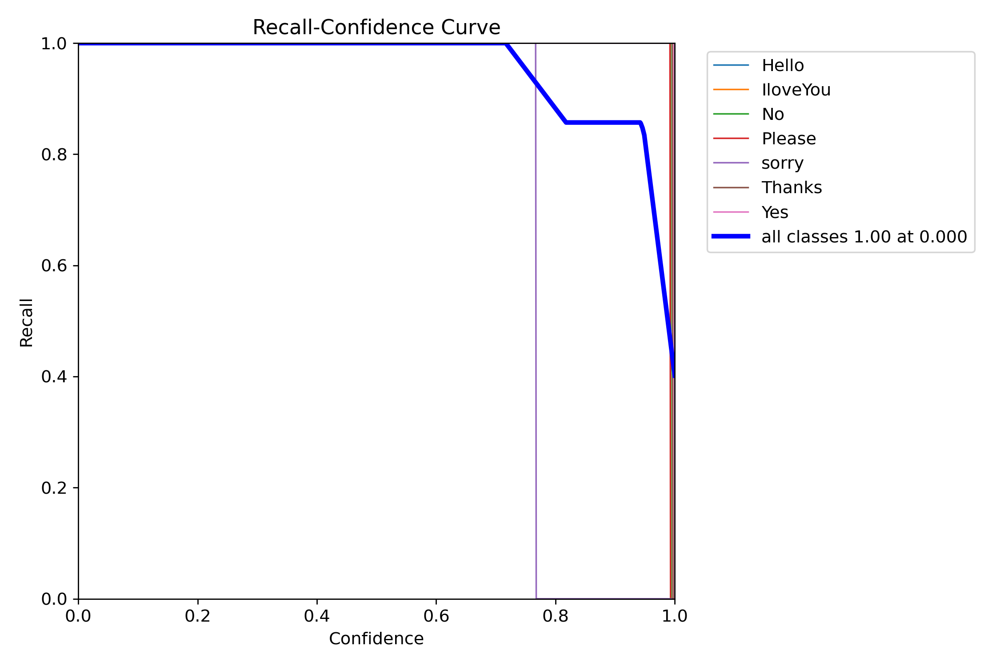
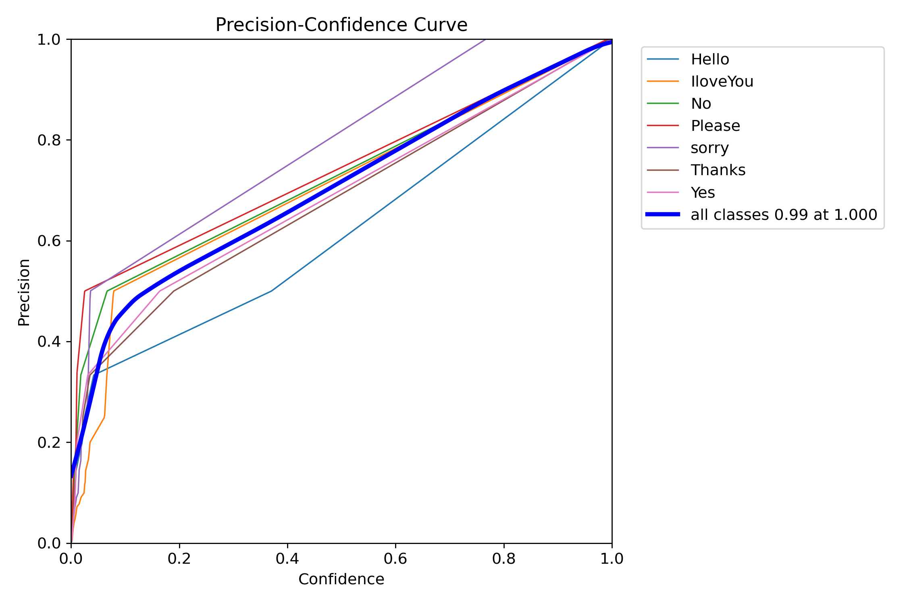
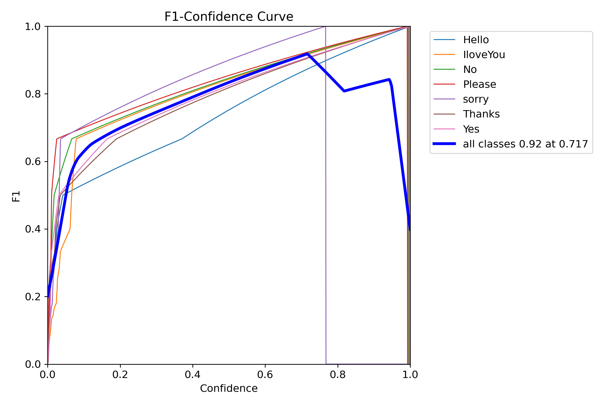
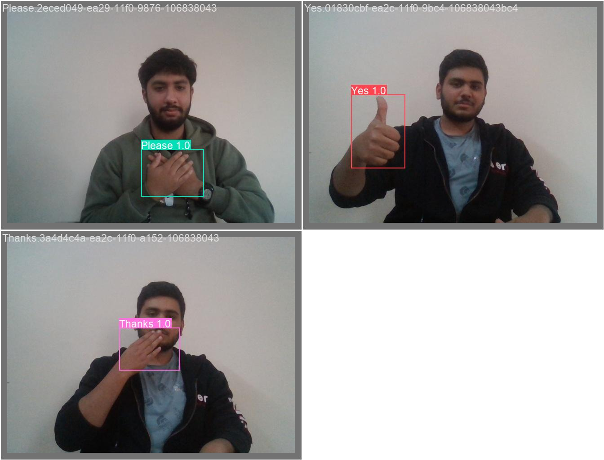

# 🚀 Custom Object Detection using YOLO11n (Ultralytics)

This project demonstrates how to **train YOLO11n on a custom dataset**, validate the trained model, and deploy it for **real-time object detection on mobile** using **IP Webcam + Flask**.

---

## 📌 Project Overview

In this project, we:

1. Capture custom images using a Python script
2. Label images using **LabelImg**
3. Train **YOLO11n** using **Ultralytics**
4. Validate the trained model (mAP, mAP50, mAP75)
5. Run real-time prediction using a webcam
6. Stream detection results to a **mobile browser** using Flask and IP Webcam

---

## 📂 Project Structure

```
├── capture_image.py        # Script to capture images for dataset
├── Annonation/
    ├──labelimg   # Tool used to label images
├──train/
    ├──images/
    ├──labels/
├──test/
    ├──images/
    ├──labels/                 
├── train_yolo.ipynb        # Jupyter Notebook for training, validation & prediction
├── mobile.py               # Flask app for mobile live detection
├── data.yaml               # Dataset configuration file
├── runs/                   # Auto-generated training results (graphs, weights, metrics)
└── README.md               # Project documentation
```

---

## 🛠️ Requirements

* Python 3.8 – 3.10
* OpenCV
* Flask
* Ultralytics (YOLO)
* LabelImg
* IP Webcam (Android App)

---

## 📥 Installation

Install required libraries:

```bash
pip install ultralytics opencv-python flask
```

---

## 📸 Step 1: Capture Images

Use `capture_image.py` to collect images for your custom dataset.

```bash
python capture_image.py
```

Images will be saved and later used for labeling.

---

## 🏷️ Step 2: Label Images using LabelImg

1. Open `labelimg.exe`
2. Load your captured images
3. Select **YOLO format**
4. Draw bounding boxes
5. Save labels (`.txt` files)

Make sure image and label filenames match.

---

## 📄 Step 3: Dataset Configuration (`data.yaml`)

Example:

```yaml
train: dataset/images/train
val: dataset/images/val

nc: 1
names: ['object_name']
```

---

## 📘 Step 4: Training (Jupyter Notebook)

### Cell 1: Install Ultralytics

```python
pip install ultralytics
```

### Cell 2: Load YOLO11n Model

```python
from ultralytics import YOLO

model = YOLO("yolo11n.pt")
```

### Cell 3: Train with Custom Dataset

```python
from ultralytics import YOLO

model = YOLO("yolo11n.pt")

results = model.train(
    data="data.yaml",
    epochs=30,
    imgsz=640,
    batch=2
)
```

📁 After training, a **`runs/` folder** is generated containing:

* Training graphs
* Confusion matrix
* Precision-Recall curves
* Best trained weights

---

## 📊 Step 5: Model Validation

```python
from ultralytics import YOLO

model = YOLO('runs/detect/train/weights/best.pt')

metrics = model.val()

print("mAP:", metrics.box.map)
print("mAP50:", metrics.box.map50)
print("mAP75:", metrics.box.map75)
print("Per-class mAP:", metrics.box.maps)
```

---

## 🎥 Step 6: Real-Time Prediction (Webcam)

```python
from ultralytics import YOLO

model = YOLO('runs/detect/train/weights/best.pt')

for result in model.predict(
    source=0,
    show=True,
    imgsz=640,
    conf=0.9,
    stream=True
):
    pass
```

---

## 📱 Step 7: Mobile Live Detection using IP Webcam

### 🔹 How it Works

* Mobile phone runs **IP Webcam**
* Flask app receives video stream
* YOLO detects objects
* New live stream is generated
* Open it on mobile or PC browser

---

### 📄 `mobile.py` (Flask Application)

```python
from flask import Flask, Response
import cv2
import time
from ultralytics import YOLO

app = Flask(__name__)

model = YOLO('runs/detect/train/weights/best.pt')

cap = cv2.VideoCapture('#Your open ip webcam app ip ')
cap.set(cv2.CAP_PROP_BUFFERSIZE, 1)

def generate_frames():
    while True:
        cap.grab()
        success, frame = cap.read()
        if not success:
            continue

        frame = cv2.resize(frame, (416, 320))

        results = model(frame, conf=0.3, imgsz=320)
        annotated_frame = results[0].plot()

        ret, buffer = cv2.imencode('.jpg', annotated_frame)
        if not ret:
            continue

        frame = buffer.tobytes()

        yield (b'--frame\r\n'
               b'Content-Type: image/jpeg\r\n\r\n' + frame + b'\r\n')

        time.sleep(0.03)

@app.route('/')
def video_feed():
    return Response(generate_frames(),
                    mimetype='multipart/x-mixed-replace; boundary=frame')

app.run(host='0.0.0.0', port=5000, threaded=True)
```

---

### ▶️ Run Mobile App

```bash
python mobile.py
```

Open in browser:

```
http://<your-pc-ip>:5000
```

You will see **real-time detection labels on mobile feed** 🎯

---

## 📈 Training Results

All training results, graphs, metrics, and weights are stored in:

```
runs/detect/train/
```

Includes:

* Loss curves
* Precision-Recall graphs
* Best model weights (`best.pt`)

---
.

## 📊 Training Graphs & Metrics (Visuals)

### 📉 Recall-Confidence Curve



### 📈 Precision–Confidence Curve



### 🎯 F1 Score-Confidence Curve



## 🧪 Model Prediction Results (Images)


---

## ✅ Features

✔ Custom dataset

✔ YOLO11n training

✔ Validation metrics

✔ Real-time webcam detection

✔ Mobile live streaming

✔ Lightweight & fast

---

## 📌 Technologies Used

* Python
* YOLO11n (Ultralytics)
* OpenCV
* Flask
* IP Webcam
* LabelImg

---

## 🤝 Acknowledgments

* Ultralytics YOLO
* OpenCV
* Flask Community

---


